<div align="center">

# InsightGraph — Agentic SQL Data Analyst

**Ask your database a question in plain English and get back verified SQL, a chart and a clear explanation, with every reasoning step shown.**

Built with **LangGraph**, **LangChain**, **FastAPI**, **React + TypeScript** and **Groq (GPT-OSS 120B)**.


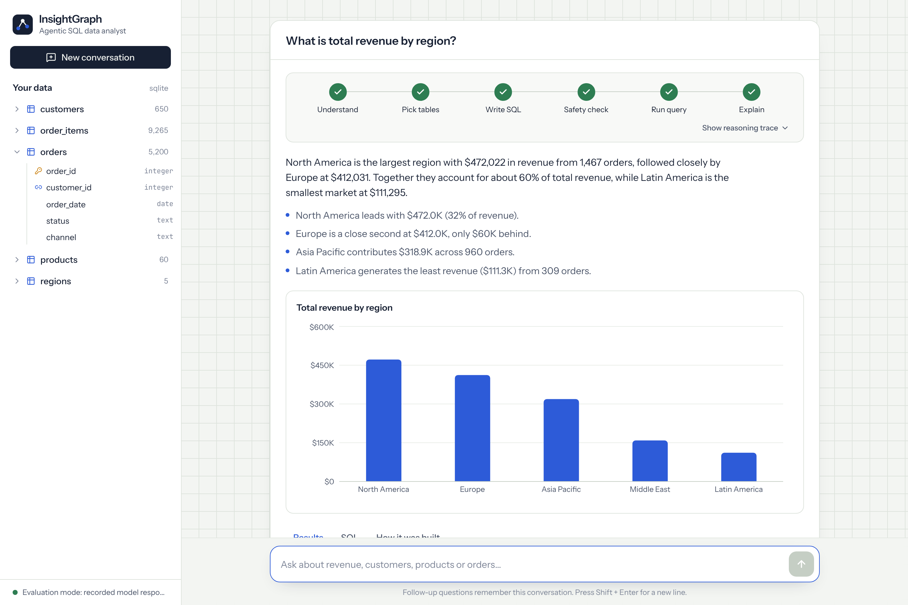

</div>

---

## Table of contents

- [Why InsightGraph](#why-insightgraph)
- [Features](#features)
- [How it works](#how-it-works)
  - [System architecture](#system-architecture)
  - [LangGraph agent workflow](#langgraph-agent-workflow)
  - [Request lifecycle](#request-lifecycle)
  - [Five layers of SQL safety](#five-layers-of-sql-safety)
  - [Data model](#data-model)
- [Screenshots](#screenshots)
- [Tech stack](#tech-stack)
- [Getting started](#getting-started)
- [Configuration](#configuration)
- [API reference](#api-reference)
- [Testing](#testing)
- [Project structure](#project-structure)
- [Documentation](#documentation)
- [Roadmap](#roadmap)
- [Author](#author)

---

## Why InsightGraph

Most business questions can be answered from data a company already has, but answering them means writing SQL. One-shot "text-to-SQL" tools generate a query and hope it works. When it fails, or quietly returns the wrong thing, the user has no way to tell. Letting an LLM run SQL against a real database is also risky.

InsightGraph works like a careful analyst instead of a single prompt:

1. **Understands** the question and rewrites follow-ups ("now only for Europe") into standalone questions.
2. **Picks only the tables it needs** and works out the join path automatically.
3. **Writes the SQL** with its reasoning and business assumptions.
4. **Checks it against five independent safety layers**: the database can never be modified.
5. **Runs it, and fixes its own mistakes**: errors and empty results are fed back so it can rewrite the query (up to 3 attempts).
6. **Explains the result** in plain language, with key findings, an automatically chosen chart and follow-up questions.

Every step streams to the UI in real time, so users can see exactly how each answer was produced.

## Features

| | Feature | Details |
|---|---|---|
| 🧠 | **Multi-step LangGraph agent** | 9-node state machine with conditional routing, loops and checkpointed memory |
| 🔁 | **Self-correction loop** | SQL errors, guard violations and empty results trigger a guided rewrite (configurable budget) |
| 🛡️ | **Read-only by design** | Regex pre-check, LLM intent router, sqlglot AST guard, read-only connection, timeout and row limit |
| 🗺️ | **Schema-aware retrieval** | Live introspection; the model selects tables and an FK path search adds bridge tables |
| 💬 | **Conversational memory** | Thread-scoped checkpointer; follow-ups are rewritten with context and shown as "Interpreted as …" |
| 📊 | **Automatic visualisation** | Line, bar (single or grouped), donut and KPI tiles, validated against the real result columns |
| ⚡ | **Live streaming** | Server-Sent Events emit each node as it finishes; the UI animates a six-stage pipeline |
| 🔍 | **Full transparency** | Reasoning trace with timings, SQL viewer, assumptions, tables used and every fixed error |
| 📥 | **Results workspace** | Sortable, paginated table with currency and percentage formatting and CSV export |
| 🧪 | **Deterministic test suite** | 111 automated tests (92 backend + 19 frontend), including golden business scenarios, that run without network or API key |
| 🐳 | **One-command deploy** | Multi-stage Docker image serving the API and the React app on one port |

## How it works

### System architecture

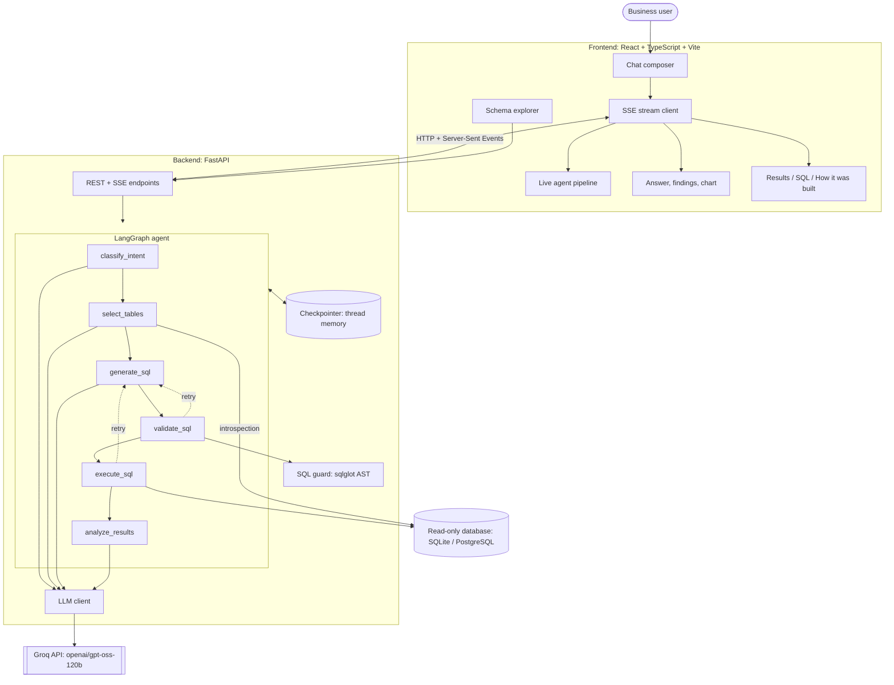
```mermaid
flowchart TB
    U([Business user]) --> UI

    subgraph FE["Frontend: React + TypeScript + Vite"]
        UI[Chat composer] --> SSE[SSE stream client]
        SSE --> PIPE[Live agent pipeline]
        SSE --> ANS[Answer, findings, chart]
        SSE --> TAB[Results / SQL / How it was built]
        SCH[Schema explorer]
    end

    subgraph BE["Backend: FastAPI"]
        API["REST + SSE endpoints"]
        subgraph AG["LangGraph agent"]
            N1[classify_intent] --> N2[select_tables] --> N3[generate_sql] --> N4[validate_sql] --> N5[execute_sql] --> N6[analyze_results]
            N4 -. retry .-> N3
            N5 -. retry .-> N3
        end
        CP[(Checkpointer: thread memory)]
        GUARD[SQL guard: sqlglot AST]
        LLMC[LLM client]
    end

    GROQ[[Groq API: openai/gpt-oss-120b]]
    DB[(Read-only database: SQLite / PostgreSQL)]

    SSE <-->|HTTP + Server-Sent Events| API
    SCH --> API
    API --> AG
    AG <--> CP
    N4 --> GUARD
    N1 & N2 & N3 & N6 --> LLMC --> GROQ
    N5 --> DB
    N2 -->|introspection| DB
```

### LangGraph agent workflow

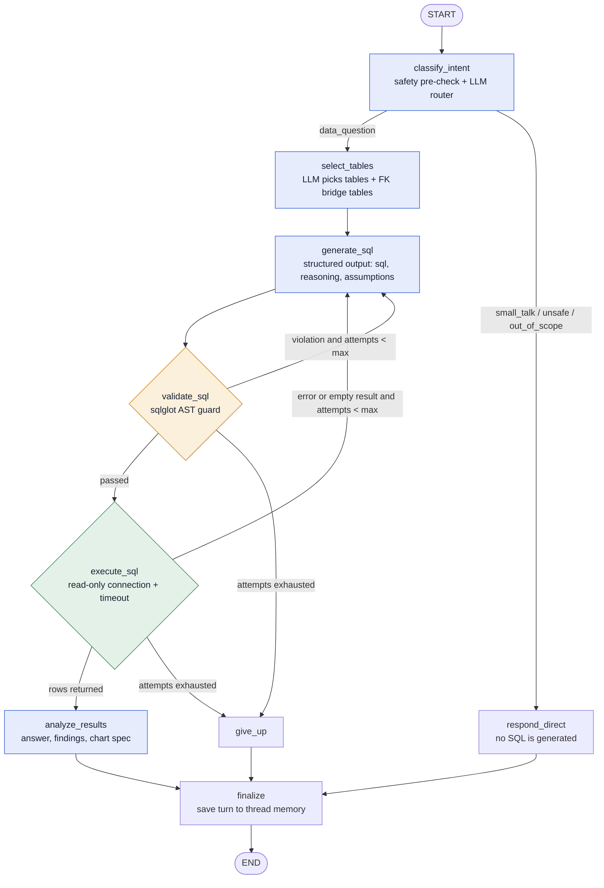
```mermaid
flowchart TD
    S([START]) --> CI[classify_intent<br/>safety pre-check + LLM router]
    CI -->|data_question| ST[select_tables<br/>LLM picks tables + FK bridge tables]
    CI -->|small_talk / unsafe / out_of_scope| RD[respond_direct<br/>no SQL is generated]
    ST --> GS[generate_sql<br/>structured output: sql, reasoning, assumptions]
    GS --> VS{validate_sql<br/>sqlglot AST guard}
    VS -->|passed| EX{execute_sql<br/>read-only connection + timeout}
    VS -->|violation and attempts < max| GS
    EX -->|rows returned| AR[analyze_results<br/>answer, findings, chart spec]
    EX -->|error or empty result and attempts < max| GS
    VS -->|attempts exhausted| GU[give_up]
    EX -->|attempts exhausted| GU
    AR --> FN[finalize<br/>save turn to thread memory]
    RD --> FN
    GU --> FN
    FN --> E([END])

    classDef llm fill:#e6ecfb,stroke:#2d5bd8,color:#172033
    classDef guard fill:#fbf0dc,stroke:#c97f0c,color:#172033
    classDef db fill:#e3f1e8,stroke:#2e7d52,color:#172033
    class CI,ST,GS,AR llm
    class VS guard
    class EX db
```

| Node | Responsibility | Structured output |
|------|----------------|-------------------|
| `classify_intent` | Deterministic destructive-intent check, then LLM routing and standalone rewrite using history | `IntentDecision` |
| `select_tables` | Chooses tables from the live catalog; BFS over foreign keys adds join bridges | `TableSelection` |
| `generate_sql` | Writes dialect-specific SQL using business rules, history and the previous error | `SQLDraft` |
| `validate_sql` | AST safety rules and LIMIT enforcement (no LLM) | — |
| `execute_sql` | Read-only execution with timeout; flags errors and empty results for retry | — |
| `analyze_results` | Answer, findings, chart spec and follow-ups; chart validated against the columns | `InsightReport` |
| `respond_direct` / `give_up` / `finalize` | Refusals and greetings, graceful failure, conversation memory | — |

### Request lifecycle

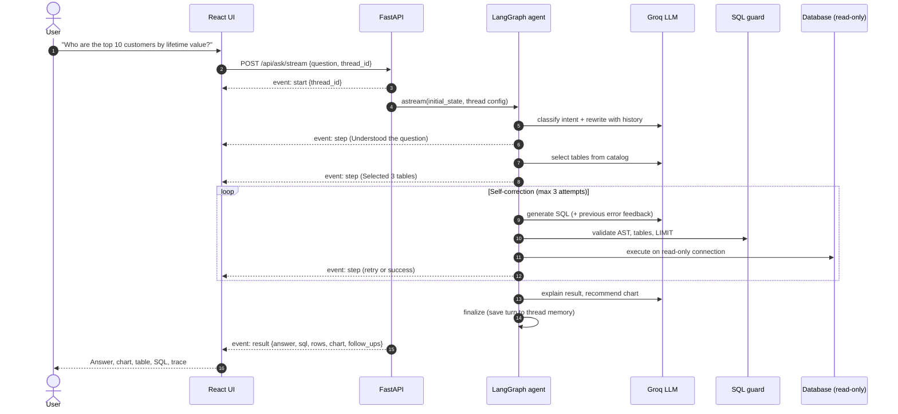
```mermaid
sequenceDiagram
    autonumber
    actor User
    participant UI as React UI
    participant API as FastAPI
    participant G as LangGraph agent
    participant L as Groq LLM
    participant Q as SQL guard
    participant D as Database (read-only)

    User->>UI: "Who are the top 10 customers by lifetime value?"
    UI->>API: POST /api/ask/stream {question, thread_id}
    API-->>UI: event: start {thread_id}
    API->>G: astream(initial_state, thread config)
    G->>L: classify intent + rewrite with history
    G-->>UI: event: step (Understood the question)
    G->>L: select tables from catalog
    G-->>UI: event: step (Selected 3 tables)
    loop Self-correction (max 3 attempts)
        G->>L: generate SQL (+ previous error feedback)
        G->>Q: validate AST, tables, LIMIT
        G->>D: execute on read-only connection
        G-->>UI: event: step (retry or success)
    end
    G->>L: explain result, recommend chart
    G->>G: finalize (save turn to thread memory)
    API-->>UI: event: result {answer, sql, rows, chart, follow_ups}
    UI-->>User: Answer, chart, table, SQL, trace
```

### Five layers of SQL safety

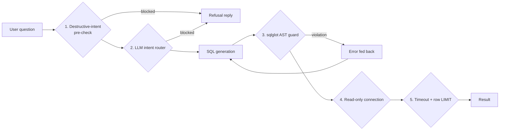
```mermaid
flowchart LR
    Q[User question] --> L1{1. Destructive-intent<br/>pre-check}
    L1 -->|blocked| R[Refusal reply]
    L1 --> L2{2. LLM intent router}
    L2 -->|blocked| R
    L2 --> GEN[SQL generation]
    GEN --> L3{3. sqlglot AST guard}
    L3 -->|violation| FB[Error fed back] --> GEN
    L3 --> L4{4. Read-only connection}
    L4 --> L5{5. Timeout + row LIMIT}
    L5 --> OK[Result]
```

The AST guard allows exactly one statement with a `SELECT` / `UNION` / `WITH` root. It rejects any `INSERT`, `UPDATE`, `DELETE`, DDL, `PRAGMA`, `ATTACH` or `SET` anywhere in the tree, including inside CTEs. It also rejects unknown tables and dangerous functions, and it always applies a row `LIMIT`. SQLite is opened with `mode=ro`, and PostgreSQL transactions are set to `READ ONLY`, so layers 3–5 hold even if the model misbehaves.

### Data model

The application ships with a realistic e-commerce dataset (650 customers, 60 products, 5,200 orders, about 9,300 order lines, Jan 2025 to Oct 2026). It is generated deterministically with regional growth, year-end seasonality, segment-specific buying patterns and discounts. Point `DATABASE_URL` at any SQLite or PostgreSQL database to analyse your own data.

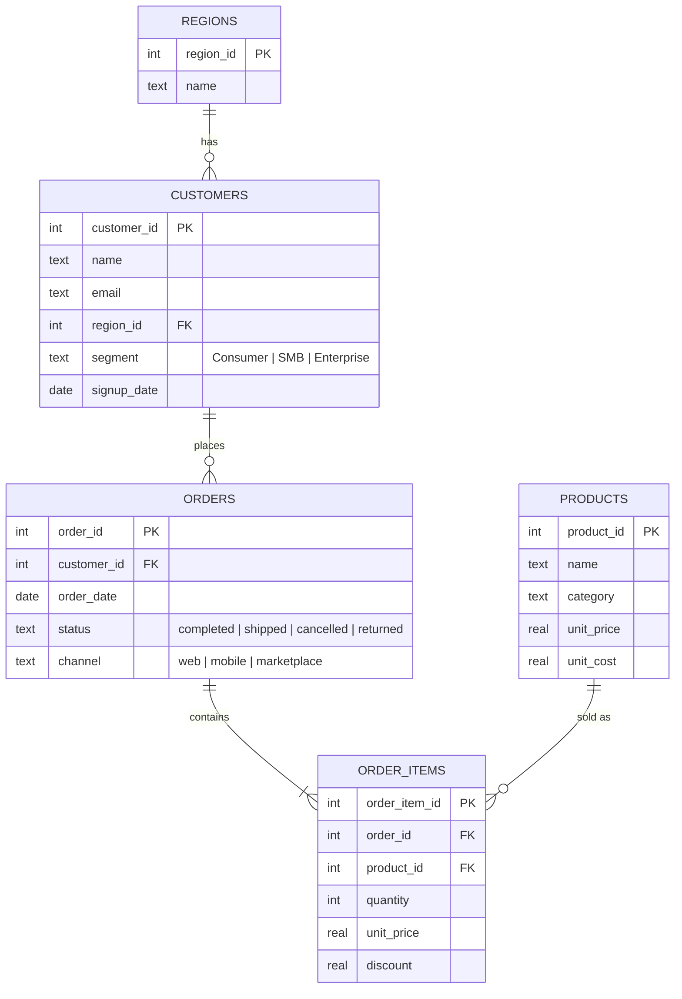
```mermaid
erDiagram
    REGIONS ||--o{ CUSTOMERS : "has"
    CUSTOMERS ||--o{ ORDERS : "places"
    ORDERS ||--|{ ORDER_ITEMS : "contains"
    PRODUCTS ||--o{ ORDER_ITEMS : "sold as"

    REGIONS {
        int region_id PK
        text name
    }
    CUSTOMERS {
        int customer_id PK
        text name
        text email
        int region_id FK
        text segment "Consumer | SMB | Enterprise"
        date signup_date
    }
    PRODUCTS {
        int product_id PK
        text name
        text category
        real unit_price
        real unit_cost
    }
    ORDERS {
        int order_id PK
        int customer_id FK
        date order_date
        text status "completed | shipped | cancelled | returned"
        text channel "web | mobile | marketplace"
    }
    ORDER_ITEMS {
        int order_item_id PK
        int order_id FK
        int product_id FK
        int quantity
        real unit_price
        real discount
    }
```

Rendered PNG versions of all diagrams, including a deployment diagram and the graph exported directly from LangGraph, are in [`docs/diagrams`](docs/diagrams).

## Screenshots

All screens below were captured from the running application answering live questions with Groq (`openai/gpt-oss-120b`) against the sample database. Every answer, SQL query, chart and timing is real output.

| Home | Answer with chart |
|---|---|
| 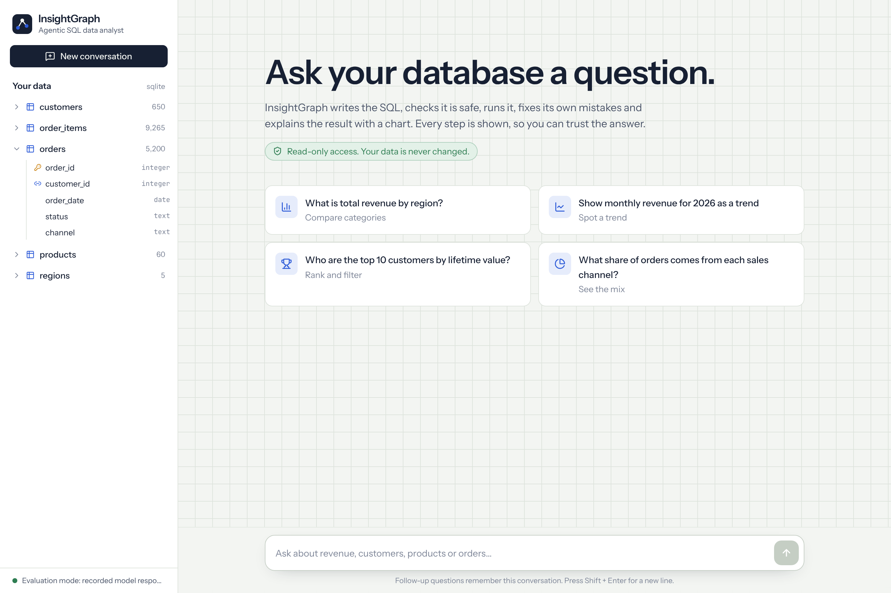 | 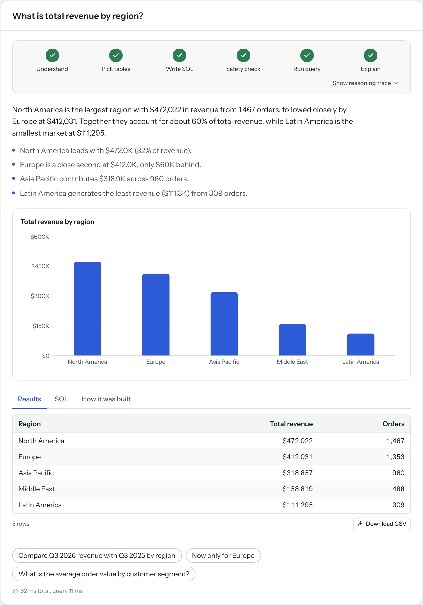 |

| Self-correction: the first SQL failed and the agent fixed it | Follow-up question using conversation memory |
|---|---|
| 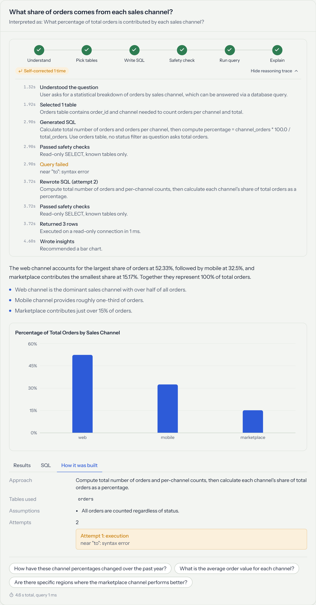 | 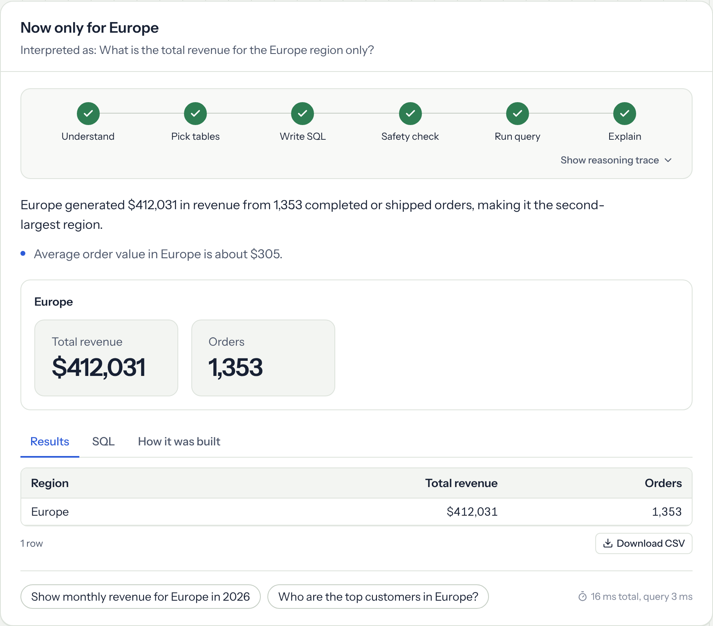 |

| Year-over-year comparison with generated SQL | Monthly trend |
|---|---|
| 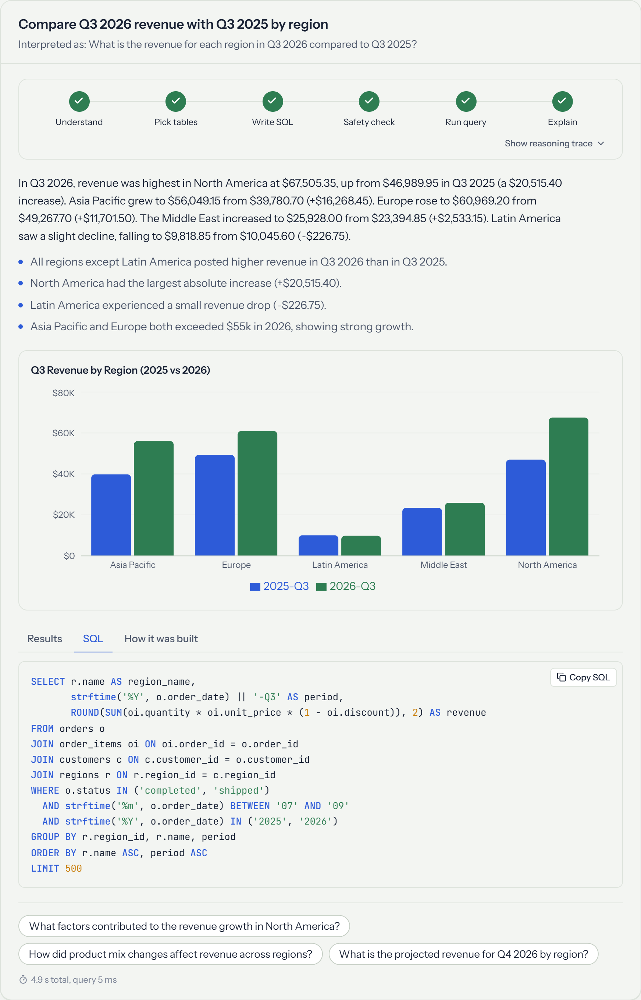 | 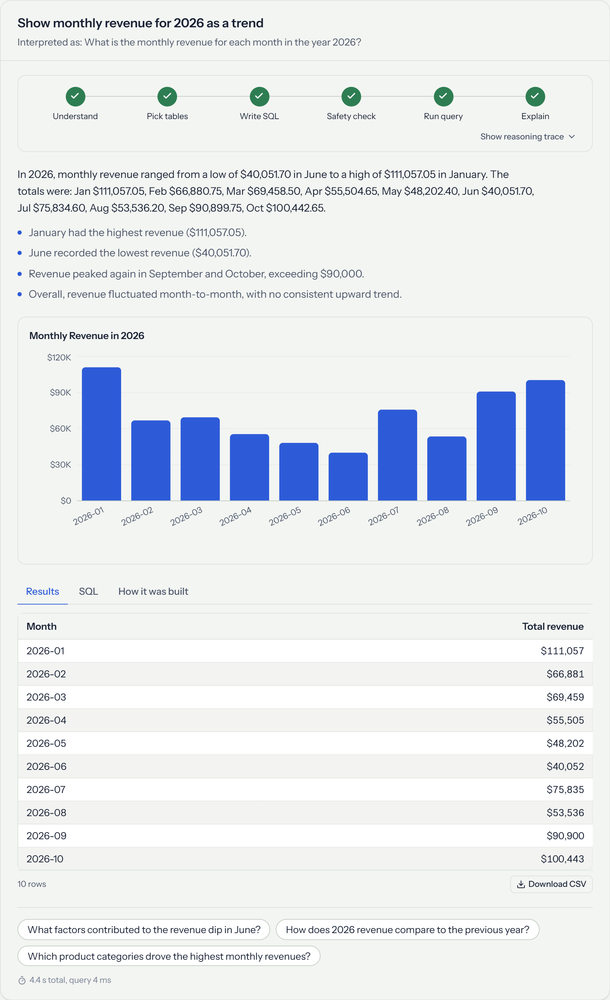 |

| Ranking with full results table | Margin analysis (self-corrected) |
|---|---|
| 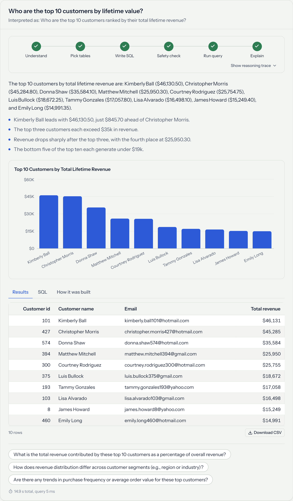 | 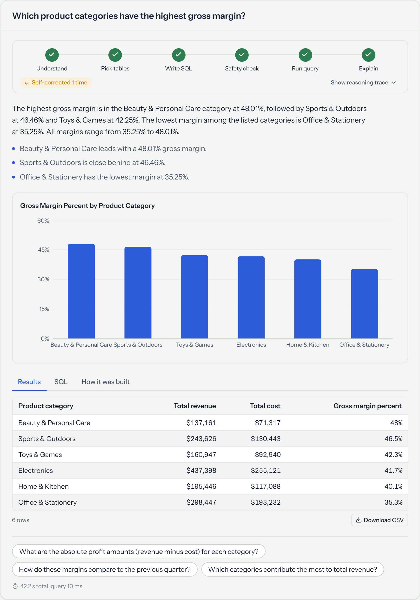 |

| Share of orders by channel | Free-form question: return rate by region |
|---|---|
| 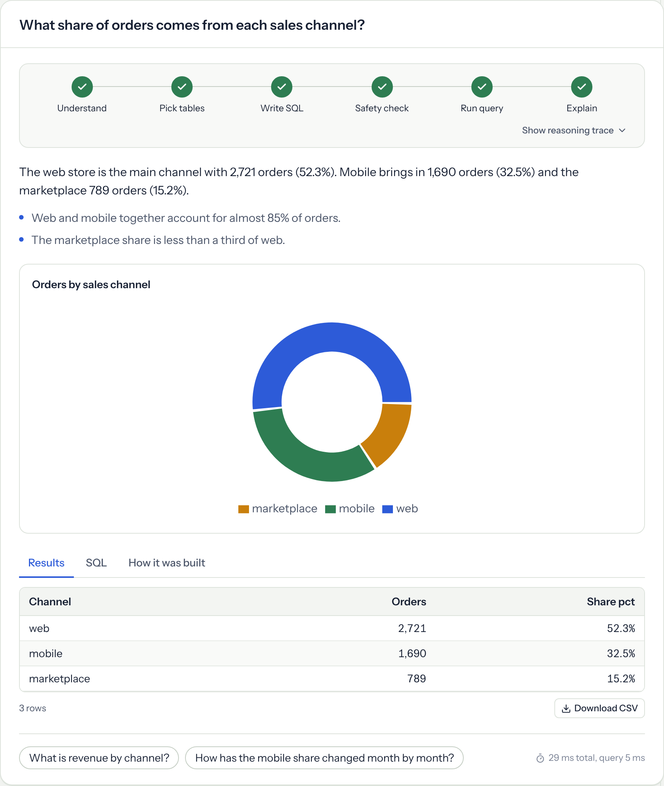 | 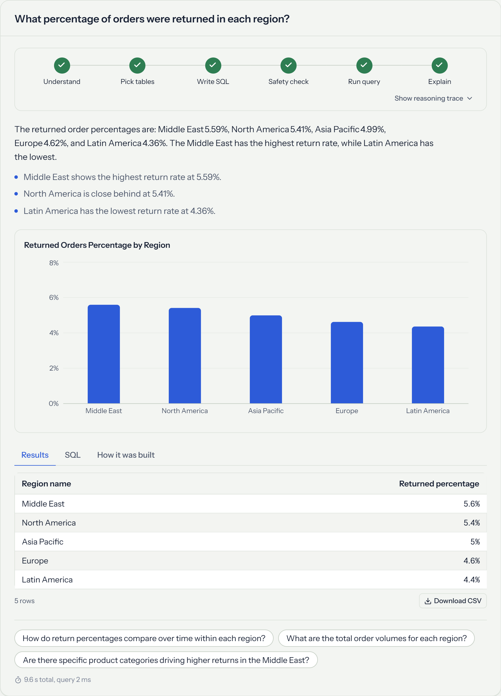 |

| Destructive request blocked | Mobile |
|---|---|
| 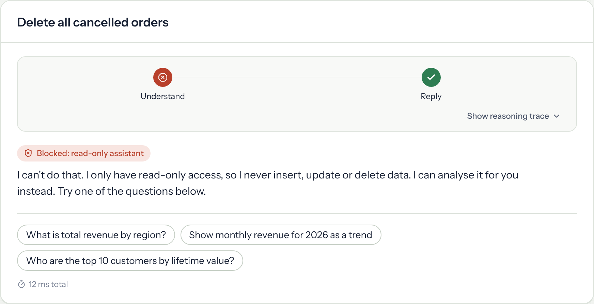 | 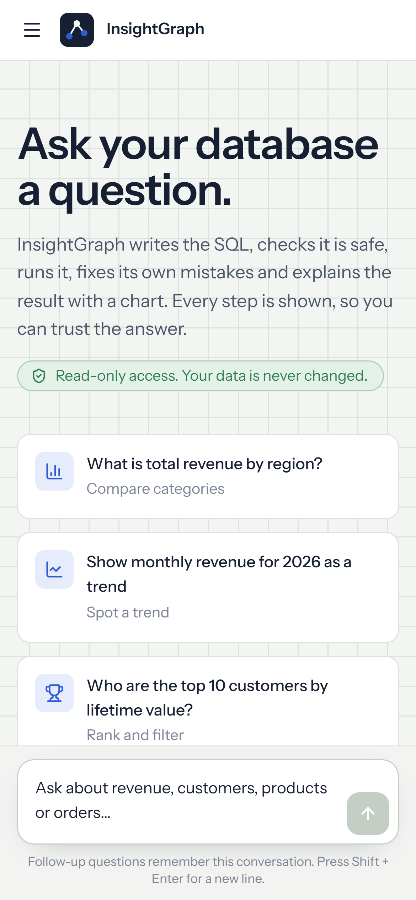 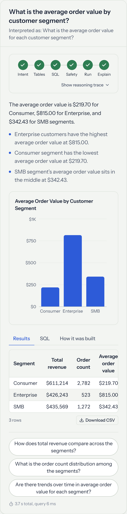 |

## Tech stack

| Layer | Technology |
|-------|-----------|
| Agent orchestration | LangGraph 1.x (StateGraph, conditional edges, checkpointer) |
| LLM framework | LangChain Core (prompt templates, structured output), `langchain-groq` |
| LLM | Groq: `openai/gpt-oss-120b` with low reasoning effort (configurable, e.g. `llama-3.3-70b-versatile`) |
| SQL safety | sqlglot (AST parsing and transpiling) |
| Data access | SQLAlchemy 2 (SQLite, PostgreSQL) |
| API | FastAPI, sse-starlette, Pydantic v2, pydantic-settings |
| Frontend | React 18, TypeScript, Vite 6, Tailwind CSS 4, Recharts, Lucide icons |
| Quality | pytest, ruff, TypeScript strict mode, GitHub Actions |
| Delivery | Docker (multi-stage), Docker Compose |

## Getting started

### Prerequisites

- Python 3.11+ and Node.js 22+, **or** Docker
- A free Groq API key from [console.groq.com/keys](https://console.groq.com/keys)

### Option A: Docker (one command)

```bash
git clone https://github.com/MHassan-AiExpert/Insight-Graph-Agentic-SQL-Data-Analyst-.git
cd Insight-Graph-Agentic-SQL-Data-Analyst-
cp .env.example .env          # add your GROQ_API_KEY
docker compose up --build
```

Open **http://localhost:8000**. The sample database is created automatically on first start.

### Option B: Local development

```bash
# 1. Backend
cd backend
python -m venv .venv && source .venv/bin/activate      # Windows: .venv\Scripts\activate
pip install -r requirements-dev.txt
cp ../.env.example ../.env                              # add your GROQ_API_KEY
python -m app.db.seed                                   # creates backend/data/insightgraph.db
uvicorn app.main:app --reload --port 8000

# 2. Frontend (new terminal)
cd frontend
npm install
npm run dev
```

Open **http://localhost:5173**. The Vite dev server proxies `/api` to the backend.

### Try these questions

- What is total revenue by region? → *Now only for Europe*
- Show monthly revenue for 2026 as a trend
- Who are the top 10 customers by lifetime value?
- Compare Q3 2026 revenue with Q3 2025 by region
- Which product categories have the highest gross margin?
- What share of orders comes from each sales channel?
- Delete all cancelled orders *(blocked)*

## Configuration

All settings are environment variables (see [`.env.example`](.env.example)).

| Variable | Default | Description |
|----------|---------|-------------|
| `GROQ_API_KEY` | — | Groq API key (required for `groq`) |
| `GROQ_MODEL` | `openai/gpt-oss-120b` | Any Groq chat model with tool calling |
| `LLM_REASONING_EFFORT` | `low` | Reasoning effort for gpt-oss models (`low`, `medium`, `high`) |
| `LLM_PROVIDER` | `groq` | `groq`, or `scripted` for deterministic evaluation runs |
| `DATABASE_URL` | bundled SQLite | Any SQLAlchemy URL, e.g. `postgresql+psycopg://…` |
| `MAX_SQL_ATTEMPTS` | `3` | Self-correction budget |
| `MAX_RESULT_ROWS` | `500` | Enforced row limit |
| `QUERY_TIMEOUT_SECONDS` | `10` | Statement timeout |
| `HISTORY_TURNS` | `5` | Turns kept in conversation memory |
| `BUSINESS_RULES` | revenue / profit / AOV definitions | Metric definitions injected into the SQL prompt |

## API reference

Interactive OpenAPI docs are served at **`/docs`**.

| Method | Endpoint | Description |
|--------|----------|-------------|
| `POST` | `/api/ask/stream` | Ask a question; streams `start`, `step`… and `result` as Server-Sent Events |
| `POST` | `/api/ask` | Ask a question; returns the full JSON answer |
| `GET` | `/api/schema` | Tables, columns, keys and row counts |
| `GET` | `/api/threads/{thread_id}` | Conversation memory of a thread |
| `GET` | `/api/examples` | Suggested questions |
| `GET` | `/api/health` | API, model and database status |

```bash
curl -N -X POST http://localhost:8000/api/ask/stream \
  -H "Content-Type: application/json" \
  -d '{"question": "What is total revenue by region?"}'
```

<details>
<summary>Example <code>result</code> payload</summary>

```json
{
  "thread_id": "9f1c…",
  "status": "answered",
  "answer": "North America is the largest region with $472,022 in revenue…",
  "key_findings": ["North America leads with $472.0K (32% of revenue)."],
  "sql": "SELECT r.name AS region, ROUND(SUM(oi.quantity * oi.unit_price * (1 - oi.discount)), 2) AS total_revenue …\nLIMIT 500",
  "columns": ["region", "total_revenue", "orders"],
  "rows": [["North America", 472022.45, 1467], ["Europe", 412031.4, 1353]],
  "chart": {"type": "bar", "x": "region", "y": ["total_revenue"], "title": "Total revenue by region"},
  "follow_ups": ["Compare Q3 2026 revenue with Q3 2025 by region"],
  "attempts": 1,
  "attempt_log": []
}
```
</details>

## Testing

```bash
cd backend && pytest          # 92 passed
cd frontend && npm test       # 19 passed
```

| Suite | Tests | Covers |
|-------|------:|--------|
| `test_sql_guard.py` | 27 | Allowed and blocked queries, nested DML in CTEs, LIMIT handling, intent pre-check |
| `test_database.py` | 9 | Introspection, read-only connection, timeout, readable errors |
| `test_seed.py` | 5 | Deterministic data, counts, integrity, business constraints |
| `test_config.py` | 4 | Defaults, environment overrides, CORS parsing, business rules |
| `test_llm.py` | 9 | Scripted provider, schema validation, Groq client setup, reasoning effort, prompt rendering |
| `test_charts.py` | 9 | Chart recommendation, validation and long-format series detection |
| `test_graph.py` | 11 | Routing, self-correction (execution, validation, empty result), give-up, memory, thread isolation |
| `test_api.py` | 8 | REST + SSE contract, validation, history |
| `test_scenarios.py` | 10 | Golden business scenarios end-to-end against the real database |
| `frontend/src/__tests__` | 19 | Formatting, chart data pivoting, SSE stream parsing, Pipeline, ResultsTable and Composer components |

The backend suite uses a scripted LLM that replays structured responses. The real graph, guard and database code paths run on every test, and CI needs no API key. The full test plan is in [`docs/04-test-cases.md`](docs/04-test-cases.md), and every module has its own report with its test cases in [`reports/`](reports).

## Project structure

```
.
├── backend/
│   ├── app/
│   │   ├── agent/
│   │   │   ├── graph.py        # LangGraph StateGraph: nodes, conditional edges, checkpointer
│   │   │   ├── nodes.py        # Node implementations + routing functions
│   │   │   ├── state.py        # AgentState TypedDict
│   │   │   ├── schemas.py      # Pydantic structured outputs
│   │   │   ├── prompts.py      # ChatPromptTemplates
│   │   │   └── llm.py          # LLM client protocol: Groq + scripted provider
│   │   ├── api/routes.py       # REST + SSE endpoints
│   │   ├── db/
│   │   │   ├── database.py     # Read-only engine, execution, introspection
│   │   │   └── seed.py         # Deterministic sample e-commerce dataset
│   │   ├── services/
│   │   │   ├── sql_guard.py    # sqlglot AST safety guard
│   │   │   └── charts.py       # Chart validation + fallback recommender
│   │   ├── config.py           # pydantic-settings configuration
│   │   └── main.py             # FastAPI app, CORS, SPA hosting
│   ├── tests/                  # 92 tests + golden scenario fixtures
│   ├── requirements.txt
│   └── pyproject.toml
├── frontend/
│   └── src/
│       ├── App.tsx             # Layout, conversation state, streaming
│       ├── api.ts              # Typed API + SSE client
│       ├── format.ts           # Number, currency and percent formatting
│       ├── components/         # Pipeline, AnswerSheet, ResultChart, ResultsTable, SqlViewer, Sidebar, Composer
│       └── __tests__/          # 19 Vitest + Testing Library tests
├── docs/
│   ├── 01-project-document.md
│   ├── 02-system-design.md
│   ├── 03-system-features.md
│   ├── 04-test-cases.md
│   ├── 05-ui-ux-design.md
│   ├── diagrams/               # Mermaid sources + rendered PNGs
│   └── screenshots/
├── reports/                    # One report per module: how it works, how it was built, test cases
├── .github/workflows/ci.yml    # Lint, tests, frontend build, Docker build
├── Dockerfile                  # Multi-stage: Node build → Python runtime
├── docker-compose.yml
└── .env.example
```

## Documentation

| Document | Contents |
|----------|----------|
| [Project document](docs/01-project-document.md) | Problem, objectives, scope, stack, delivery plan, risks, acceptance criteria |
| [System design](docs/02-system-design.md) | Architecture, graph nodes and edges, state, self-correction, memory, safety, API and SSE contract, data model, deployment, scaling |
| [System features](docs/03-system-features.md) | Detailed feature catalogue |
| [Test cases](docs/04-test-cases.md) | Test strategy, functional, security, chart and UI test cases |
| [UI/UX design](docs/05-ui-ux-design.md) | Personas, information architecture, design tokens, components, states, accessibility, responsive rules |
| [Module reports](reports) | One report per module (configuration, database, data generator, SQL guard, LLM layer, LangGraph agent, charts, API, frontend, testing/CI) with design decisions and test results |
| [Diagrams](docs/diagrams) | Architecture, LangGraph workflow, generated graph, sequence, ER, safety layers, deployment |

## Roadmap

- Persistent thread memory with LangGraph `PostgresSaver`
- Embedding-based table retrieval for schemas with hundreds of tables
- Human-in-the-loop approval (LangGraph `interrupt`) for expensive queries
- Saved questions and scheduled reports
- Additional providers (OpenAI, Gemini) behind the same `LLMClient` interface

## Author

**Muhammad Hassan**, AI Automation Engineer & Full Stack Developer
GitHub: [@MHassan-AiExpert](https://github.com/MHassan-AiExpert)

## License

Released under the [MIT License](LICENSE).
